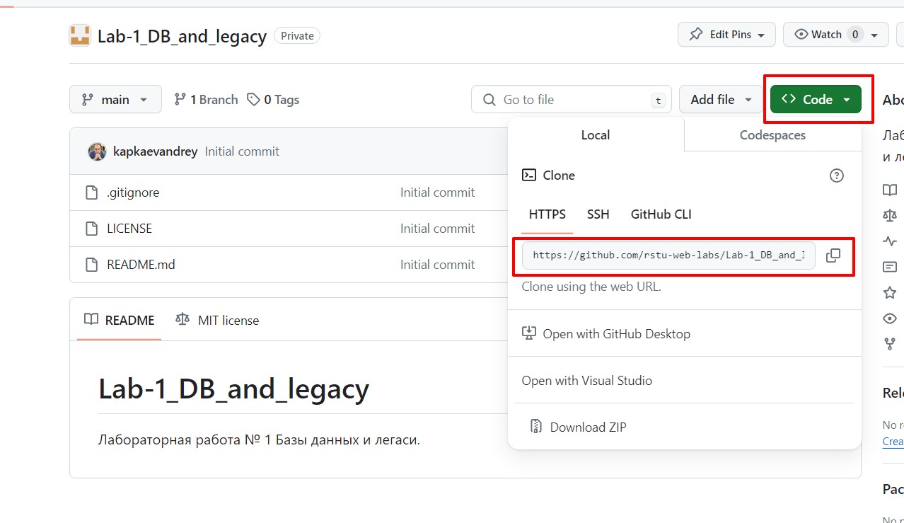

# Веб программирование курс лабораторных работ
## <span style="color:#4b0082">_Второй семестр_</span>
> ***Билл Гейтс***
>> Успех — паршивый учитель. 
> Он заставляет умных людей думать, что они не могут проиграть

______________________________________________________________________________
______________________________________________________________________________
## Навигация:

### [Интро](#intro)

### [Что понадобиться для работы](#must_have)

### [Мои лабы, один репозиторий](#repo_fork)

### [Как сдавать на проверку лабы](#review)

### [Обязательно к прочтению](#read_this)

### [Репозитории с лабораторными](labs.md)

______________________________________________________________________________
______________________________________________________________________________
### Интро<a name="intro"></a>
Если вы это читаете, то вы или случайно наткнулись на данный репозиторий, либо вам посчастливилось попасть нак курс
веб-программирования.  
И так, в данном репозитории будут находиться ссылки на все репозитории в которых вы будете делать свои лабораторные работы.

Данный репозиторий может и будет дополняться, все модификации будут вноситься в репозитории с заданиями.
______________________________________________________________________________
### Что понадобиться для работы<a name="must_have"></a>
Для выполнения лабораторных работ вам понадобиться:
1) аккаунт на [**Github**](https://github.com/). Зарегистрироваться будет довольно просто.
2) Для работы вам понадобиться [**Git**](https://git-scm.com/), если вы владелец Windows вам пригодиться установиться себе [**GitBash**](https://git-scm.com/download/win)
3) Настроить **git bash** для работы следуя официальной [инструкции](https://git-scm.com/book/ru/v2/%D0%92%D0%B2%D0%B5%D0%B4%D0%B5%D0%BD%D0%B8%D0%B5-%D0%9F%D0%B5%D1%80%D0%B2%D0%BE%D0%BD%D0%B0%D1%87%D0%B0%D0%BB%D1%8C%D0%BD%D0%B0%D1%8F-%D0%BD%D0%B0%D1%81%D1%82%D1%80%D0%BE%D0%B9%D0%BA%D0%B0-Git)
4) Также вам потребуется IDE ([**Visual Studio Code**](https://code.visualstudio.com/) или [**Pycharm Community Edition**](https://www.jetbrains.com/pycharm/download/?section=windows)
5) Также потребуется [**Docker**](https://www.docker.com/products/docker-desktop/)
6) Приложение для удобной работы с СУБД, мы рекомендуем [**DBeaver**](https://dbeaver.io/download/)

*Если у вас что-то не получается или вы не понимаете, что делать, обязательно свяжитесь со своим преподавателем*
______________________________________________________________________________
### Мои лабы, один репозиторий<a name="repo_fork"></a>
Все свои лабораторные вы будете выполнять в своей ветке которая будет создаваться на основании ветки **main** репозитория с лабораторной работой.

#### Клонируйте себе на локальную машину репозиторий с лабораторной работой
|  |
|-------------------------------|

```shell
git clone https://github.com/rstu-web-labs/<path>
```

#### Создайте ветку в которой вы будете работать над своей версией решения и переключитесь на неё
**Правила именования веток:**
Ветка должна быть именованна в следующем формате **<group>/<surname>**
Где **group** название группы и одновременно тег (aib042), **surname** ваша фамилия на английском **tupin**

```shell
git branch aib042/tupin
git checkout aib042/tupin
```

### Обновляйте свой репозиторий в случае изменений
```shell
git checkout main
git pull
git checkout aib042/tupin
git merge main
```
______________________________________________________________________________
#### Как сдавать на проверку лабы <a name="review"></a>
1) Все решения вы сохраняете в своей ветке, в момент когда вы готовы сдавать решение вам понадобиться создать Pull Request и запросить Ревью у своего преподавателя.
2) В случае успешного решения PR будет помечен как **Approved** и в дальнейшем закрыт.
3) В случае неудачи он будет заблокирован с замечаниями. [**Документация**](https://docs.github.com/en/pull-requests/collaborating-with-pull-requests/proposing-changes-to-your-work-with-pull-requests/creating-a-pull-request)
4) Каждый проект должен снабжаться документацией оформленной в формате [**Markdown**](https://www.markdownguide.org/basic-syntax/)
______________________________________________________________________________
### Обязательно к прочтению <a name="read_this"></a>
Если вы прочитали весь свод правил указанных выше, и готовы их соблюдать - **"Добро пожаловать в команду!"**
Также как в любой командной разработке мы будем придерживать стиля и простых правил перечисленных и принятых выше.

|  |
|------------------------|

1) Каждый проект и лабораторная работа будет предполагать наличие **_Мягкого_** и **_Жёсткого_** дедлайн.
2) Сроки дедлайна указываются в самой лабораторной. 
3) Отсчёт срока исполнения начинается с даты проведения лабораторной работы.
4) Если ваше решение не сдано на проверку после наступления жёсткого дедлайн, оно проверятся не будет и вы не будете допущены до сдачи экзамена.
5) Проверка работ будет производиться только на самих лабораторных работах, просмотр кода и консультации тоже, но вы по-прежнему сможете задавать вопросы в чате, и не забывайте про мемасы.
6) Если вы прислали решение в рамках дедлайна и оно не верное мы конечно немного потерпим, но если PR с замечаниями будет висеть пару недель, он будет закрыт и смотрите пункт 4.

Однако если вы нарушаете правила и выкладываете решения не в том виде в котором они указаны в описании выше или в описании самой лабораторной работы:
#### Мы не будем проверять ваше задание пока вы не приведёте его к указанному формату (*цените время других разработчиков*)

Ещё несколько нюансов которые мы искренне рекомендуем соблюдать:
1) Не пытайтесь сдать все лабы в один день, никто не будет проверять такой огромный объём материала за один день (**цените время других разработчиков**)
2) Пишите свои решения, пусть они будут плохими и будут основаны на подсказах, но они будут ваши (**цените время и труд других разработчиков**)
3) Критика приветствуется, если вы нашли баг в задании, обязательно сообщите об этом, а лучше создайте [**PR**](https://docs.github.com/en/pull-requests/collaborating-with-pull-requests/proposing-changes-to-your-work-with-pull-requests/creating-a-pull-request)

В случае отказа от попытки сделать, что-то самостоятельно, задания буду усложняться и сроки на их выполнения тоже.

______________________________________________________________________________
##### Пожалуйста, соблюдайте правила
Со своей стороны мы постараемся обеспечить вам максимально комфортное прохождение курса
______________________________________________________________________________
#### Всегда рады вам на курсе

______________________________________________________________________________
